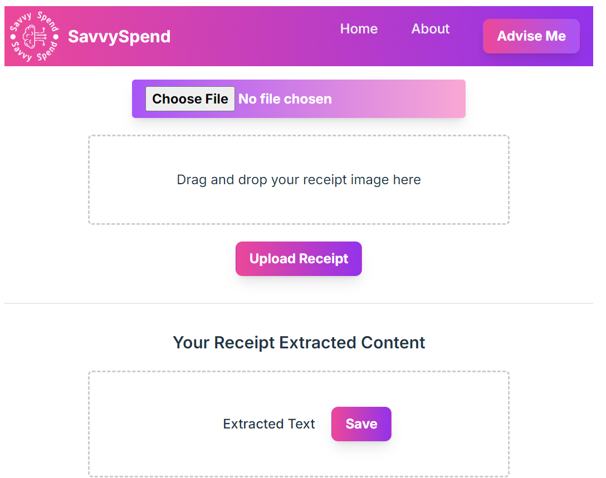

# SavvySpend: AI-Driven Budgeting Web Application

## Overview

SavvySpend is a user-friendly web application that leverages artificial intelligence (AI) to empower users in managing their finances effectively. The application scans and categorizes expenditures, identifies spending patterns, and provides personalized money-saving tips. By using AI as a personal financial assistant, SavvySpend aims to empower users by providing actionable insights, personalized tips, and smart spending recommendations.

## How it Works

1. **Receipt Upload**: Users upload an image of a receipt.
   
2. **Text Extraction**: The text is extracted from the receipt image using OCR algorithms (npm package `tesseract.js` is used).
3. **Item Categorization**: The extracted items from the receipt are categorized by AI (OpenAI-gpt-3.5-turbo model) and stored in a MySQL table.
4. **Advice Generation**: When a user asks for advice, SavvySpend uses the saved data to generate a pie chart of expenditure categories. With the assistance of AI, the user's shopping pattern is analyzed and four pieces of advice are generated based on the user's shopping pattern.

## Tech Stack

- **Frontend**: Vite.js, Tailwind CSS
- **Backend**: Node.js, Express.js
- **Database**: MySQL
- **Libraries**: Google Charts
- **NPM Packages**: express, path, multer, react-dropzone, axios, react-loader-spinner, tesseract.js, sequelize

## Getting Started

Instructions for setting up the project locally will be added here.

## Contributing

Guidelines for contributing to the project will be added here.

## License

Information about the project's license will be added here.
